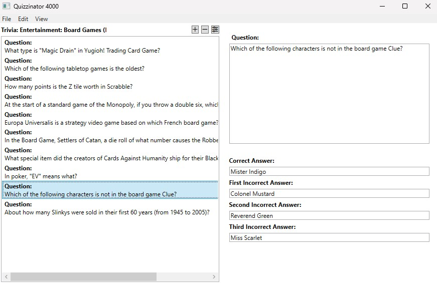
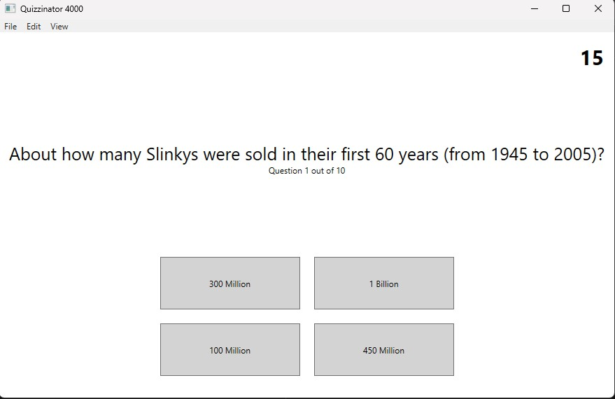
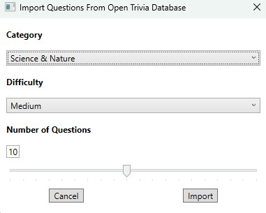

# QuizApp - WPF MVVM Quiz Application
### Overview

QuizApp is a feature-rich quiz application built with C# and WPF following the MVVM (Model-View-ViewModel) architectural pattern. The application allows users to create, edit, and play quiz packs with multiple-choice questions. It also features integration with the Open Trivia Database API for importing external quiz questions.

#### Key Features

* Quiz Pack Management
  * Create, edit, and delete question packs
  * Configure difficulty levels and time limits
  * Save and load question packs locally




* Quiz Gameplay
  * Randomized question order for varied gameplay
  * Timed questions with configurable time limits
  * Visual feedback for correct/incorrect answers
  * Score tracking



* External API Integration
   * Import questions from Open Trivia Database
   * Dynamic category fetching
   * Customizable difficulty and question count



* User Interface
  * Intuitive navigation between configuration and play modes
  * Keyboard shortcuts for common actions
  * Fullscreen toggle for distraction-free quiz taking

### Technologies Used

- C# .NET - Core programming language and framework
- WPF - Windows Presentation Foundation for UI
- MVVM Pattern - For separation of concerns and maintainable code
- HttpClient - For API integration
- JSON - For serialization/deserialization
- XAML - For UI layout and styling

###   Architecture

The application follows the MVVM (Model-View-ViewModel) pattern:

* Models: Core data structures like Question, QuestionPack, and API response models
* ViewModels: Classes that handle UI logic and data preparation
* Views: XAML UI components with minimal code-behind
*Services: Handle data operations and API communication


### Dynamic Question Rendering

The application dynamically renders questions and answers in a 2x2 grid layout, with proper handling of answer state visualization:

```
public void SelectAnswer(object? answer)
{
    // Dynamic UI state management based on answer correctness
    foreach (var option in CurrentQuestion.AnswerOptions)
    {
        if (isCorrectAnswer)
        {
            option.State = option == asModel ? AnswerState.Correct : AnswerState.Neutral;
        }
        else
        {
            option.State = option.IsCorrect ? AnswerState.Correct : AnswerState.Incorrect;
        }
    }
}
```

### Dialog Management

The application implements a reusable dialog pattern for consistent user interaction:


```
public async void OpenExternalImportOptions(object? arg)
{
    var viewModel = new ExternalImportOptionsViewModel(_importerService);
    var window = new ExternalImportOptionsWindow { DataContext = viewModel };
    viewModel.SetDialogWindow(window);
    window.ShowDialog();
    
    if (viewModel.DialogResult)
    {
        // Process result...
    }
}
```
### API Integration

Seamless integration with external API for question importing:

```
public async Task<QuestionPack> GetQuestionPackAsync(
    int numberOfQuestions,
    string categoryId,
    Difficulty difficulty)
{
    // API communication with proper error handling
    // HTML entity decoding
    // Mapping to application models
}

```
Setup and Installation

1. Clone the repository
2. Open the solution in Visual Studio 2022
3. Build the solution
4. Run the application

## Future Improvements

* Additional question types (true/false, fill-in-the-blank)
* Custom themes and styling options
* Statistics and performance tracking
* Export/import quiz packs as files for sharing

###  About the Developer

This project was developed as part of a .NET/C# learning journey, focusing on proper implementation of MVVM architecture and API integration in WPF applications.
